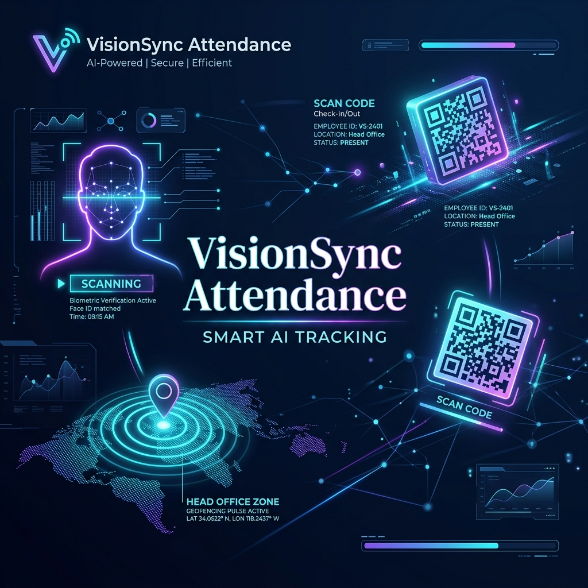
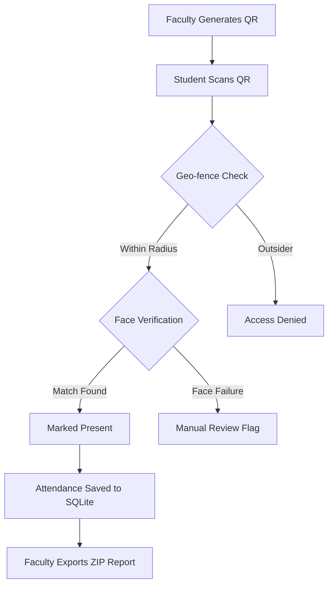

# 🛡️ VisionSync Attendance System

[](https://www.python.org/)
[](https://flask.palletsprojects.com/)
[](https://opencv.org/)
[](https://www.sqlite.org/)



VisionSync is a cutting-edge, secure attendance tracking solution that leverages **AI Facial Recognition**, **Dynamic QR Codes**, and **Geo-fencing** to eliminate proxy attendance and ensure 100% verification accuracy.

---

## ✨ Key Features


-   **🤖 AI Facial Verification**: High-precision face recognition using `dlib` and `face_recognition` to ensure the correct student is present.
-   **📍 Smart Geo-fencing**: GPS-based location validation ensures attendance can only be marked within the classroom perimeter (radius-controlled).
-   **🔗 Dynamic QR Sessions**: Faculty-generated unique session tokens with automated expiration to prevent link sharing.
-   **📱 Device Fingerprinting**: Security measure to bind attendance marking to specific student devices.
-   **📊 Data Insights & Export**: Comprehensive faculty dashboard with real-time logs and ZIP/CSV export capabilities (including captured verify images).

---

## 🚀 How it Works



---

## 🛠️ Tech Stack

-   **Backend**: Python / Flask
-   **Computer Vision**: OpenCV, Face Recognition, NumPy
-   **Database**: SQLite (SQLAlchemy)
-   **Frontend**: HTML5, Vanilla CSS, JavaScript
-   **Security**: Geolocation API, Session Handlers, QR Code Generation

---

## 🌐 Deployment (Render.com)

This project is optimized for deployment on **Render.com**.

1.  **Create a Render Account**: Sign up at [render.com](https://render.com/).
2.  **New Web Service**: Click "New" > "Web Service" and connect your GitHub repository.
3.  **Configuration**:
    - **Runtime**: `Python`
    - **Build Command**: `pip install -r requirements.txt`
    - **Start Command**: `gunicorn app:app`
4.  **Environment Variables**: Add a secret key if needed, though the app generates one automatically.
5.  **Database**: The app uses SQLite (`attendance.db`). For a permanent database on Render, you should use their **PostgreSQL** service, but for small testing, the local SQLite file will work (note: it will reset on every redeploy unless you use a persistent disk).

---

## ⚙️ Installation (Local)

### 1. Clone the repository
```bash
git clone https://github.com/yourusername/attendance-tracking-system.git
cd attendance-tracking-system
```

### 2. Set up Virtual Environment
```bash
python -m venv venv
source venv/bin/scripts/activate  # On Windows: venv\Scripts\activate
```

### 3. Install Dependencies
```bash
pip install -r requirements.txt
```

> [!IMPORTANT]
> To use facial recognition, ensure you have **CMake** and **C++ Build Tools** installed on your system.
> ```bash
> pip install face_recognition opencv-python-headless
> ```

---

## 📖 Usage Guide

### For Faculty
1. **Login**: Use faculty credentials.
2. **Create Session**: Click "Generate QR Code", set the radius (e.g., 50m), and specify the subject.
3. **Show QR**: Display the generated QR code on the projector.
4. **Monitor**: View live updates as students mark their attendance.
5. **Export**: Once the session expires, download the ZIP report containing CSV and verification images.

### For Students
1. **Dashboard**: Register your face encoding during the first-time setup.
2. **Scan**: Scan the classroom QR code using the mobile dashboard.
3. **Verify**: The system will check your GPS location and ask for a quick face scan.
4. **Success**: Once verified, your attendance is logged instantly.

---

## 📜 Development Notes

- **Database**: The system uses `attendance.db` by default.
- **Service Worker**: PWA support included for offline-first dashboard accessibility (`static/sw.js`).
- **Demo Users**: Default test users are created on first run (`faculty1`, `student1`).

---

## 🤝 Contributing
Contributions are welcome! Please feel free to submit a Pull Request.

## 📄 License
This project is licensed under the MIT License - see the LICENSE file for details.

---

<p align="center">Made with ❤️ for Secure Education Tracking</p>
